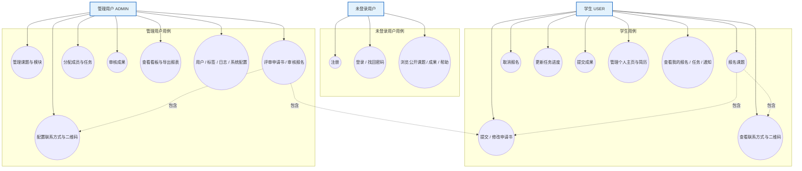
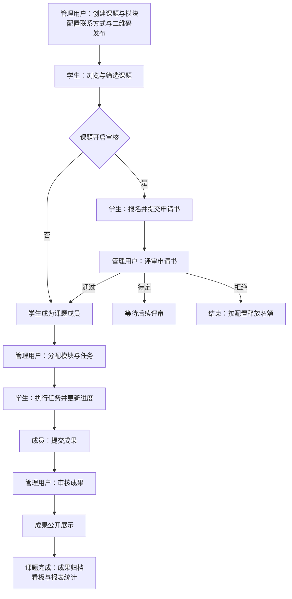
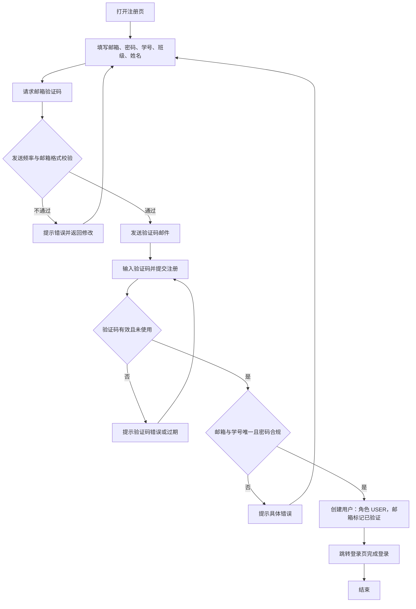
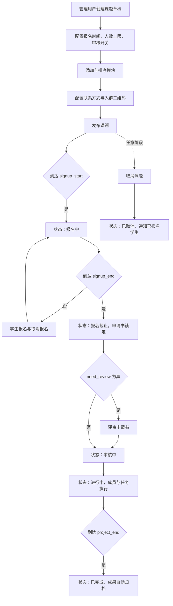
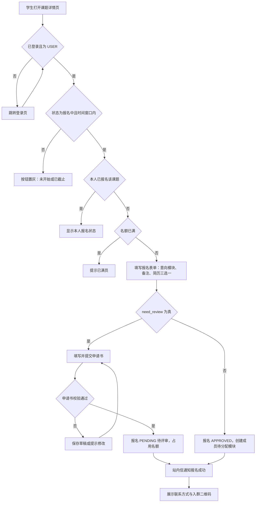
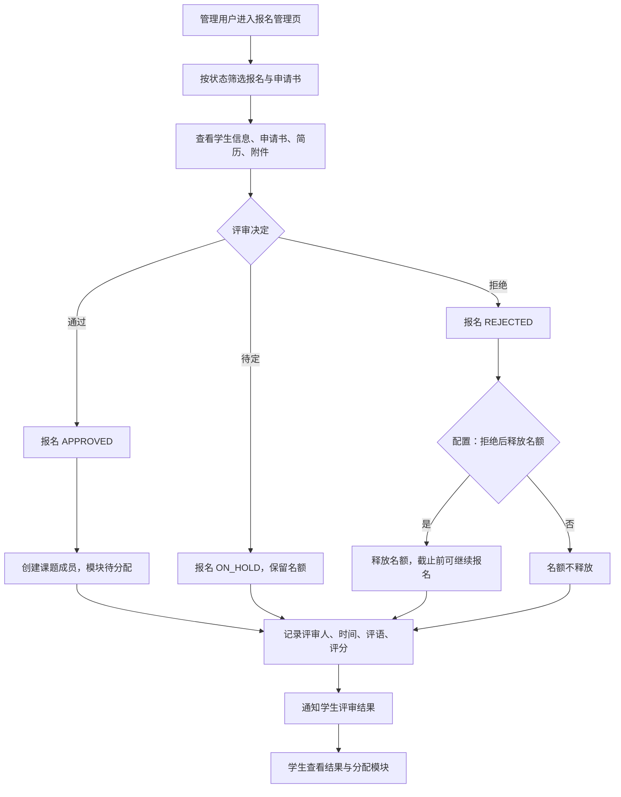
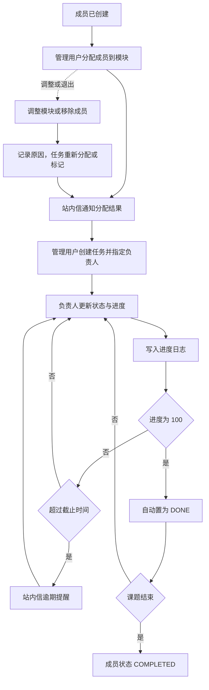
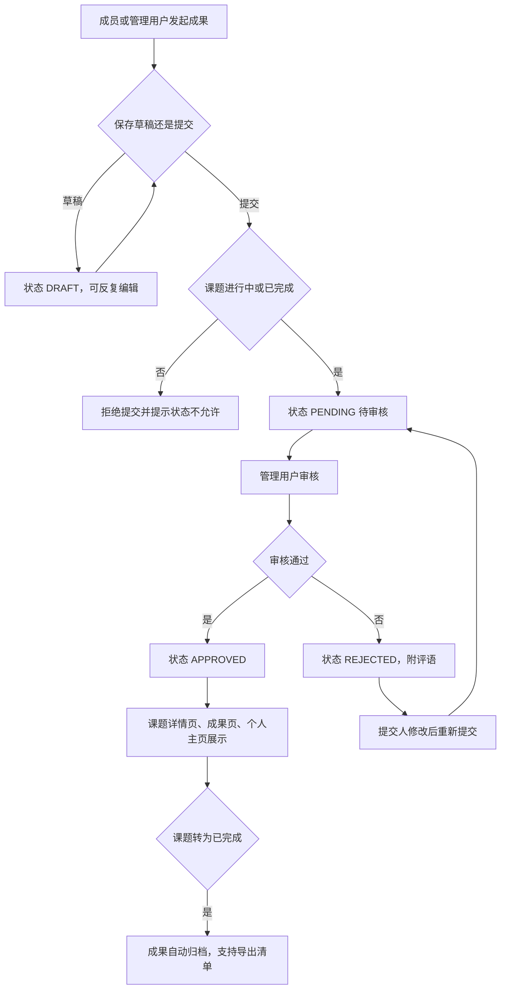
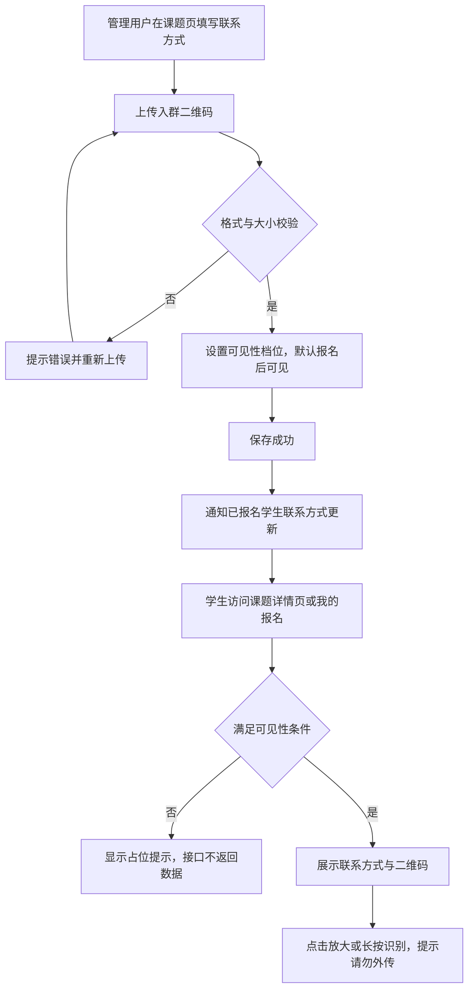

# 实验室课题报名 OA 系统 · 产品 PRD

| 项 | 内容 |
| --- | --- |
| 文档性质 | 《需求文档.md》的补充文档，提供图形化视角 |
| 内容 | 用例图（第 2 章）、业务流程图（第 3 章）、用例清单（第 4 章）、追踪矩阵（第 5 章） |
| 与需求文档关系 | 文字需求、字段、接口以《需求文档.md》为准；本 PRD 只画"怎么做流程"，不新增规则；冲突时以需求文档为准 |
| 图表格式 | Mermaid（GitHub / VS Code / Typora 可直接渲染） |

---

## 1. 文档说明

### 1.1 目的与读者

- 目的：把需求文档中的功能用**用例图**与**业务流程图**可视化，用于评审、开发排期与测试用例设计。
- 读者：产品、前后端开发、测试、实验室管理员。

### 1.2 编号约定

| 前缀 | 含义 |
| --- | --- |
| `BP-xx` | 业务流程图（Business Process），第 3 章 |
| `UC-xx` | 用例（Use Case），第 4 章 |

### 1.3 图例

**业务流程图**

| 符号 | 含义 |
| --- | --- |
| 矩形 | 动作 / 步骤 |
| 菱形 | 判断（分支上标注 是/否） |
| 实线箭头 | 流程流转 |
| 虚线箭头 | 通知 / 触发 / 异步关系 |

**用例图**

| 符号 | 含义 |
| --- | --- |
| 矩形节点 | 参与者（Actor，带角色名） |
| 圆形节点 | 用例 |
| 实线 | 参与者与用例的关联（谁能发起该用例） |
| 虚线 | 包含关系（执行该用例时必须执行另一个用例） |

---

## 2. 用例图

### 2.1 系统用例总览

**说明**

- 「报名课题」包含「提交/修改申请书」（仅开启审核的课题）与「查看联系方式与二维码」（报名成功后，按可见性）。
- 「评审申请书」包含查看学生申请书（S02）与查看学生简历（并入 A03）。
- 学生与管理用户共享"浏览公开内容"用例，未在图中重复连线。

---

## 3. 业务流程图

### BP-00 端到端总览（角色视角）

### BP-01 注册与认证

**关键规则**：BR-01（邮箱/学号唯一）、NFR-SEC-01/03（bcrypt、验证码限流）、REQ-AUTH-06（注册后需审核方可报名，可配置）。

### BP-02 课题生命周期（管理用户 + 系统自动流转）

**关键规则**：D9（已发布/报名中边界）、D18（完成即归档）、BR-08（删除/取消须通知）。

### BP-03 学生报名与申请书提交

**关键规则**：BR-03/04/05/09（名额、唯一、截止、不超卖）、D7（公开浏览）、D10（免审直通）、D16（报名与申请书同流程提交）。

### BP-04 报名审核（申请书评审）

**关键规则**：D8（PENDING/ON_HOLD 拆分）、D12（释放后截止前可再报名）、BR-16（释放名额可配置）、REQ-REV-03/07（评语评分、评审留痕）。

### BP-05 成员分配与任务进度

**关键规则**：BR-17（一成员一模块）、BR-18（负责人须为成员）、BR-19（进度留痕）、D13（模块删除保护）、D14（DONE 与 100% 联动）。

### BP-06 成果提交、审核与归档

**关键规则**：BR-20（审核通过才公开）、D18（完成自动归档）、REQ-ACH-04（拒绝须填原因）。

### BP-07 课题联系方式与入群二维码

**关键规则**：BR-26（可见性鉴权、禁公开直链）、D1（默认报名后可见）、D3（课题级单份）、D5（不加水印，仅文案提示）。

---

## 4. 用例清单

| 编号 | 用例名 | 参与者 | 简述 | 对应需求 |
| --- | --- | --- | --- | --- |
| UC-01 | 注册 | 未登录用户 | 邮箱 + 验证码注册，默认 USER | 4.1.1 |
| UC-02 | 登录 / 退出 / 找回密码 | 未登录用户 | JWT 登录、退出、验证码重置密码 | 4.1.2 |
| UC-03 | 浏览公开内容 | 未登录 / 学生 / 管理 | 课题列表与详情、模块、公开成果、帮助中心 | 4.5、4.8.3、4.12 |
| UC-04 | 报名课题 | 学生 | 条件校验、意向模块、备注、简历三选一 | 4.5 |
| UC-05 | 提交 / 修改申请书 | 学生 | 草稿、提交、截止前修改、截止后锁定 | 4.6.1 |
| UC-06 | 取消报名 | 学生 | 截止前取消并释放名额 | 4.5 |
| UC-07 | 查看联系方式与二维码 | 学生 | 按可见性档位查看 | 4.15 |
| UC-08 | 管理个人主页与简历 | 学生 | 主页编辑、简历上传/默认/删除/预览 | 4.10 |
| UC-09 | 更新任务进度 | 学生（负责人） | 状态、进度、进度说明、附件 | 4.7.2 |
| UC-10 | 提交成果 | 学生（成员） | 草稿、提交、多附件与外部链接 | 4.8.1 |
| UC-11 | 查看我的报名 / 任务 / 通知 / 统计 | 学生 | 个人维度信息聚合 | 4.5、4.9.3、4.13 |
| UC-12 | 管理课题与模块 | 管理用户 | 增删改、发布/下架、模块排序 | 4.3、4.4 |
| UC-13 | 配置联系方式与二维码 | 管理用户 | 文本、二维码上传/替换/删除、可见性 | 4.15 |
| UC-14 | 评审申请书 | 管理用户 | 通过/待定/拒绝、评语评分、批量（P2） | 4.6.2 |
| UC-15 | 管理报名名单 | 管理用户 | 完整名单、导出 CSV、审核操作 | 4.11 |
| UC-16 | 分配成员与任务 | 管理用户 | 模块分配、任务创建、负责人指定 | 4.7 |
| UC-17 | 审核成果 | 管理用户 | 通过/拒绝、评语 | 4.8.2 |
| UC-18 | 查看看板与导出报表 | 管理用户 | 6 类看板、5 类报表 | 4.9 |
| UC-19 | 用户与系统管理 | 管理用户 | 用户/标签/日志/系统配置（BR-24 自保护） | 4.14 |

---

## 5. 追踪矩阵（流程图 ↔ 需求文档）

| 流程图 | 涉及用例 | 关键需求章节 | 关键规则 / 决策 |
| --- | --- | --- | --- |
| BP-00 端到端总览 | 全部 | 1.5 | — |
| BP-01 注册与认证 | UC-01、UC-02 | 4.1 | BR-01、NFR-SEC-01/03 |
| BP-02 课题生命周期 | UC-12 | 4.3 | BR-08、D9、D18 |
| BP-03 报名与申请书 | UC-03、UC-04、UC-05、UC-07 | 4.5、4.6.1 | BR-03/04/05/09、D7、D10、D16 |
| BP-04 报名审核 | UC-14、UC-15 | 4.6.2、4.11 | BR-16、D8、D12 |
| BP-05 成员与任务 | UC-09、UC-16 | 4.7 | BR-17/18/19、D13、D14 |
| BP-06 成果提交与审核 | UC-10、UC-17 | 4.8 | BR-20、D18 |
| BP-07 联系方式与二维码 | UC-07、UC-13 | 4.15 | BR-26、D1、D3、D5 |

---

## 6. 变更管理

- 本 PRD 的图随《需求文档.md》变更同步更新；流程图中出现的判断条件均可在需求文档中找到对应 REQ / BR / D 编号。
- 决策变更走需求文档第 14 章决策记录流程，本 PRD 相应流程图同步修订。
